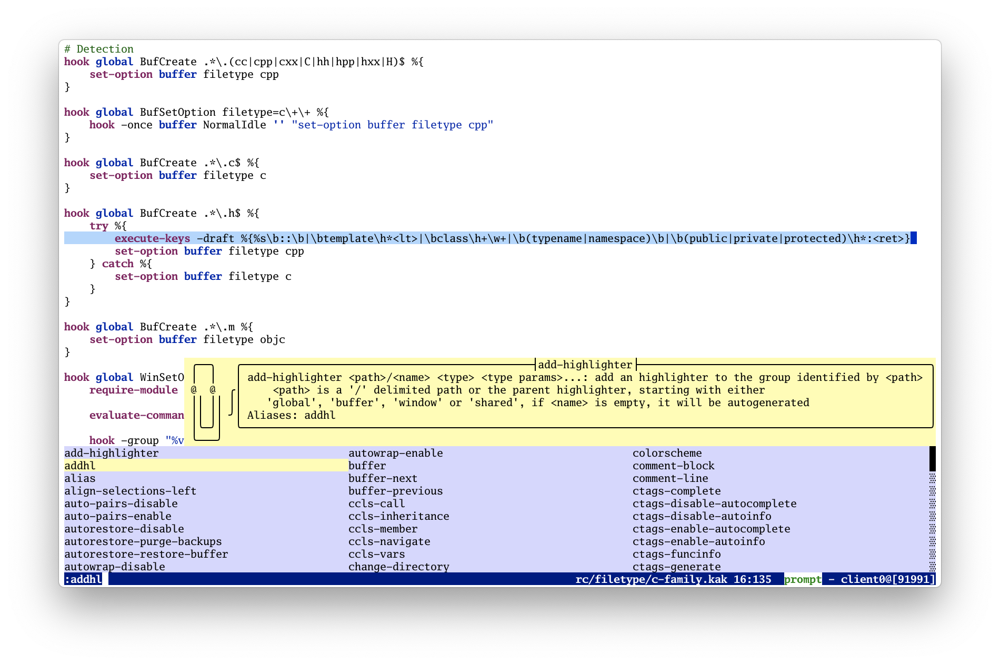

<h1 align="center">🎉 shirotelin for Kakoune 🎉</h1>

[Shirotelin](https://github.com/yasukotelin/shirotelin) is a high-contrast, light-background colorscheme that emphasizes readability.
This port is for use with the [Kakoune](https://kakoune.org) text editor.

## shirotelin family!

- [for Terminal.app](https://github.com/yasukotelin/shirotelin-terminal-app)
- [for JetBrains IDE](https://github.com/yasukotelin/shirotelin-intellij)
- [for Visual Studio Code](https://github.com/yasukotelin/shirotelin-vscode)
- [for Vim](https://github.com/yasukotelin/shirotelin)

## Supported Plugins Color⛏

- [✔] kak-lsp https://github.com/ul/kak-lsp
- [✔] kakoune-easymotion https://github.com/danr/kakoune-easymotion
- [✔] kakoune-wiki https://github.com/TeddyDD/kakoune-wiki

## Install

**Manual Install**

Copy `colors/shirotelin.kak` to `~/.config/kak/colors` and load with `:colorscheme` command.

## Screenshots

## Licence

MIT Licence
